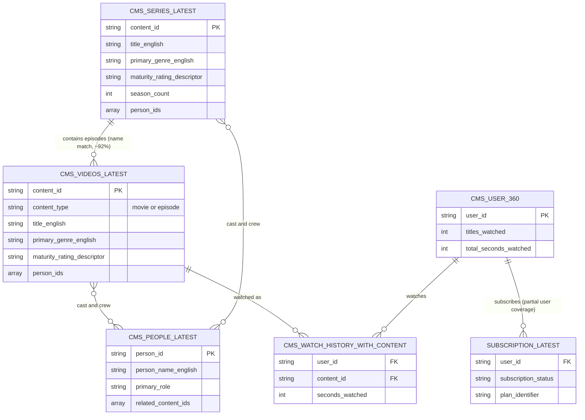

# Database Schema Map

Entity-relationship diagram of the tables relevant to the content recommendation project, using the `_latest` (deduplicated) variants throughout.

## Table notes

| Table | Row count (verified) | Primary key | Notes |
|---|---|---|---|
| `cms_v_series_latest` | 316 total = 316 distinct `content_id` | `content_id` | Fully deduplicated (unlike plain `cms_v_series`) |
| `cms_v_videos_latest` | 5,712 total = 5,712 distinct `content_id` | `content_id` | Fully deduplicated (plain `cms_v_videos` had ~18% duplicate rows). Holds both `movie` and `episode` asset-level rows — not movies-only |
| `cms_v_people_latest` | 3,767 total, 3,766 distinct `person_id` | `person_id` | Effectively deduplicated (1 residual duplicate) |
| `cms_v_watch_history_with_content` | large (millions) | composite `(user_id, content_id)` | Known duplicate-row and dedup-rule issues — see project history before use |
| `cms_v_user_360` | not yet re-verified in this project | `user_id` | Pre-aggregated engagement/subscription summary |
| `subscription_v_user_subscription_latest` | not yet re-verified in this project | `user_id` (not unique — one user can have multiple subscription records) | |

## Relationship notes (the non-obvious ones)

1. **`cms_v_videos_latest` → `cms_v_series_latest` has no formal foreign key.** Neither table carries a `series_id`/`parent_content_id` column pointing to the other. The real link is the parent show's name/slug embedded in the episode's permalink or title. Empirically tested: **92.2% match rate** (553/600 episodes) using fuzzy normalized-slug matching, across at least 4 different permalink URL schemes coexisting in the catalog (`/shows/slug`, `/series/slug`, `/show/title/slug`, `/webseries/slug`). The unmatched ~8% look mostly like standalone shorts/films mislabeled as `episode`, not real linking failures.
2. **`cms_v_all_content.series_id`/`season_id` exist as columns but are empirically empty** even for real, published episodes — not usable despite being the "obvious" formal link.
3. **`person_ids` is an array-valued many-to-many link**, not a simple foreign key — both `cms_v_videos_latest` and `cms_v_series_latest` carry an array of `person_id`s that must be exploded/joined against `cms_v_people_latest`.
4. **`cms_v_user_360` user coverage is incomplete** relative to `cms_v_watch_history_with_content` — a real gap found earlier in this project, not fully root-caused.
